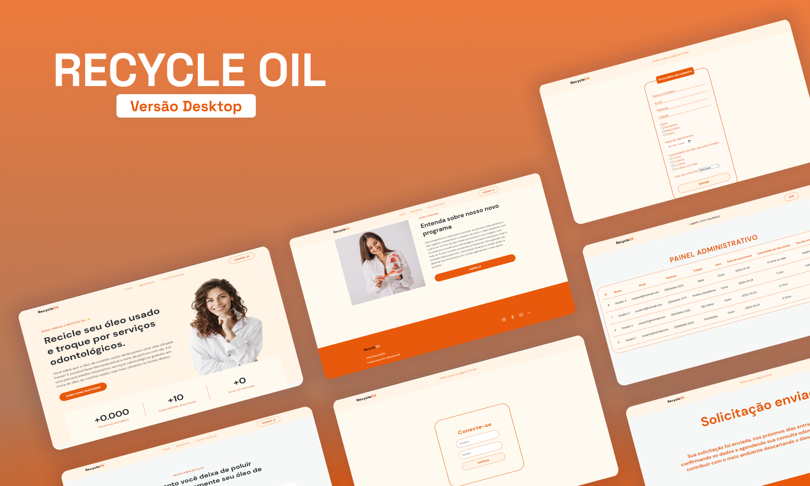
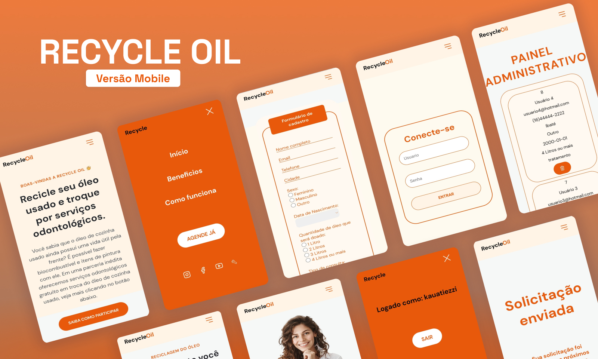

<h1 align="center"> RECYCLE OIL </h1>

Meu primeiro projeto voltado para as matérias de projeto integrado e ciências do ambiente no curso de Engenharia de Computação que estou cursando atualmente.  

  <a href="#-tecnologias">Tecnologias</a>&nbsp;&nbsp;&nbsp;|&nbsp;&nbsp;&nbsp;
  <a href="#-projeto">Projeto</a>
  

  

 

  
  

## 🚀 Tecnologias

Esse projeto foi desenvolvido com as seguintes tecnologias:

- PHP
- HTML
- CSS
- Git e Github
- Figma
- Database (MYSQL)

## 💻 Projeto

Projeto desenvolvido para um projeto escolar que consiste em incentivar as pessoas a descartarem o óleo usado corretamente, e em troca seria possível realizar procedimentos odontológicos totalmente gratuitos na minha universidade, que já atende a população por um preço baixíssimo.

- [Acesse o projeto finalizado, online.](https://recycleoil-production.up.railway.app)

---

Feito com ♥ by Kauã Tiezzi [Entre em contato comigo clicando aqui.](https://www.linkedin.com/in/kauatiezzi/)
